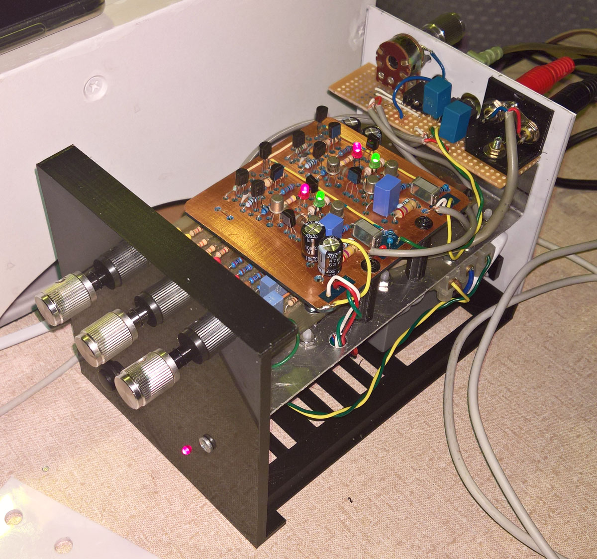
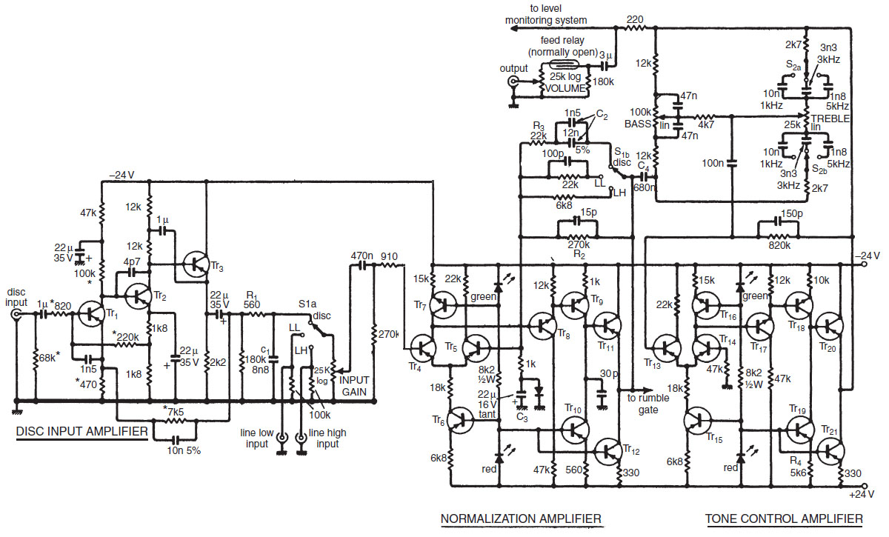
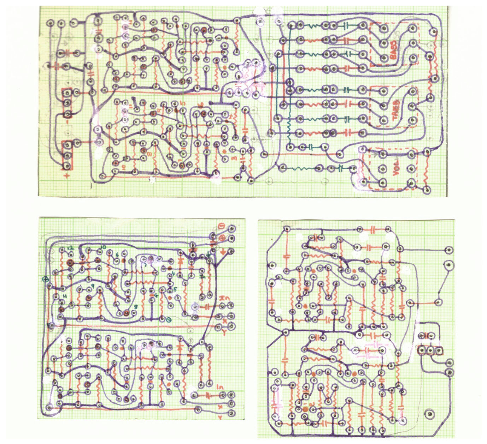
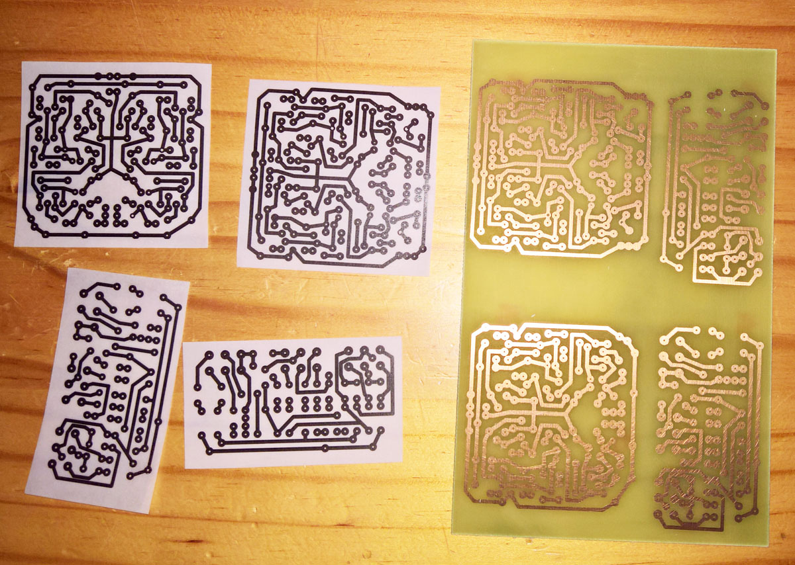
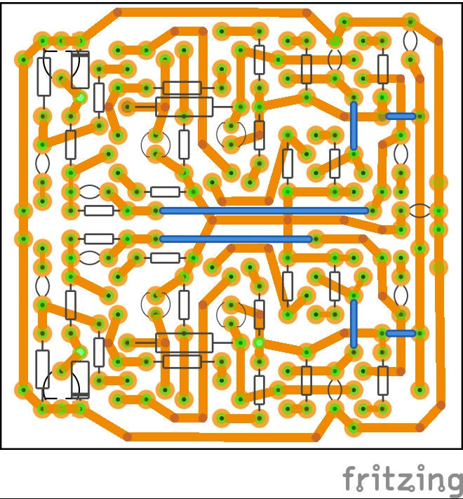
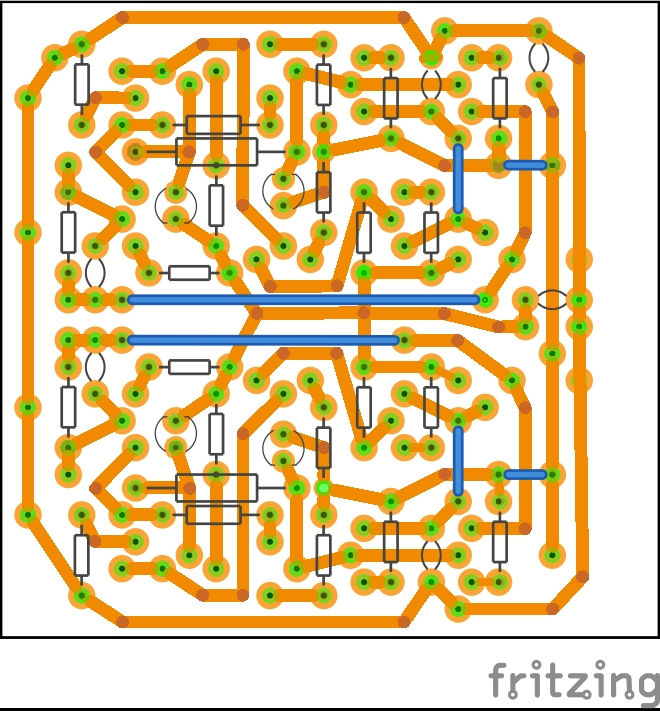
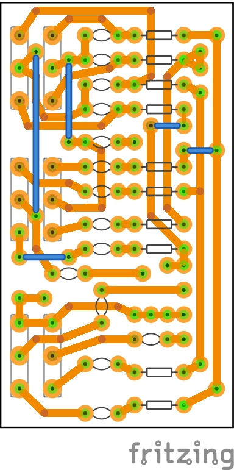
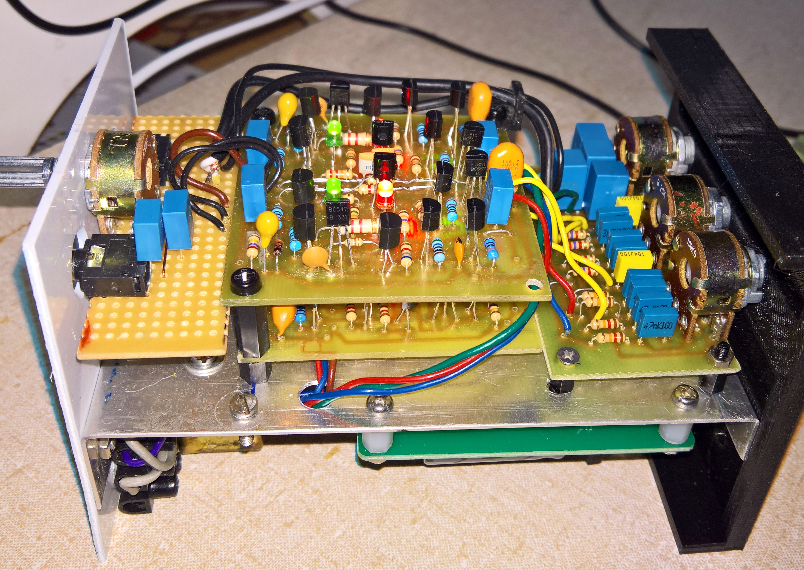

Copyright 1976 November Wireless World An Advanced Preamplifier by [**Douglas Self**](http://www.douglas-self.com/ampins/library/ampartew.htm)

Although Douglas Self is perhaps better known amongst those of a certain age, two of his audio design books are recommended right here on Github: 
[**How to learn modern electronics**](https://github.com/joaocarvalhoopen/How_to_learn_modern_electronics)

This is the most musically sounding preamp I have built. The photograph shows the two normalization and tone control PCB's constructed in the middle 1980's, re-housed in a recent (partially) 3d-printed, case. The input level control is at the back of the case. 

  
   
  	

	
Listening during the past year (2020/2021) to this preamp driving a linear-PSU-powered class-D-amp prompted the construction of a second preamp - the unpopulated PCBs have been made and the components obtained. More details are in the [AdvPreAmp2021Build](AdvPreAmp2021Build) folder including the Fritzing PCB layout files. (No, it is not cool to have to create a schematic, if all that you want is a PCB based on a perfectly good schematic that you already have.) An old trick that I use to make the PCB photomasks is to laserprint on normal white paper, rub some sunflower oil over the non-toner side, and then let it dry for 24 hours.

  
   
  
  

The Preamp electronics have been completed - only the case is left to make or print:

  

This will be almost half the size of the 1980's based preamp, and puzzlingly it has a distinctly different sound (but neither better nor worse), than the older preamp. I must still investigate this....
